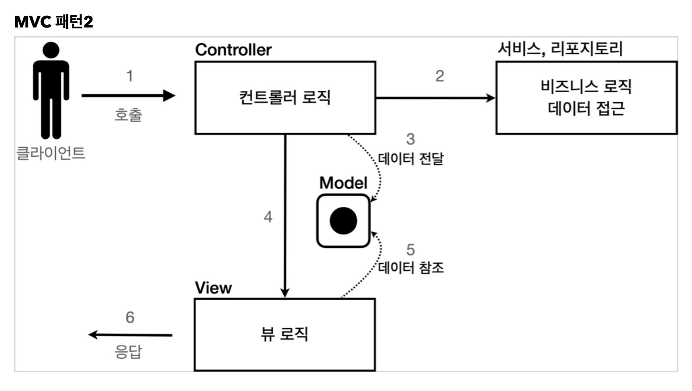

## MVC 패턴 - 개요

### 너무 많은 역할

하나의 서블릿이나 JSP이나 비즈니스 로직과 뷰 렌더링까지 모두 처리하게 되면, 너무 많은 역할을 하게된다. -> 유지보수 어려움
HTML 코드와 JAVA코드가 같이 있기 때문

### 변경의 라이프 사이클

둘 사이의 변경 라이프 사이클이 달라(비즈니스 로직과 UI) 다른것들을 하나로 관리하는 것은 유지보수하기 좋지 않다. (코드관리 측면)

### 기능 특화

특히 JSP 같은 뷰 템플릿은 화면을 렌더링 하는데 최적화 되어 있기 때문에 이 부분의 업무만 담당하는 것이 가장 효과적이다.

### Model View Controller

MVC 패턴은 지금까지 학습한 것 처럼 하나의 서블릿이나 JSP로 처리하던 것을 컨트롤러(Controller)와 뷰(View)라는 영역으로 서로 역할을 나눈 것을 말한다. 웹 애플리케이션은 보통 이 MVC 패턴을 사용한다.

- **컨트롤러** : HTTP 요청을 받아서 파라미터를 검증하고, 비즈니스 로직을 실행한다. 그리고 뷰에 전달할 결과 데이터를 조회해서 모델에 담는다.
- **모델** : 뷰에 출력할 데이터를 담아둔다. 뷰가 필요한 데이터를 모두 모델에 담아서 전달해주는 덕분에 뷰는 비즈니스 로직이나 데이터 접근을 몰라도 되고, 화면을 렌더링 하는 일에 집중할 수 있다.
- **뷰** : 모델에 담겨있는 데이터를 사용해서 화면을 그리는 일에 집중한다. 여기서 HTML을 생성하는 부분을 말한다.

