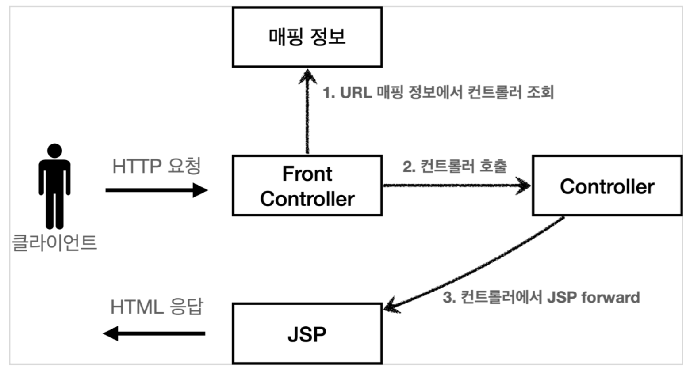

## 프론트 컨트롤러 도입 - v1

프론트 컨트롤러를 단계적으로 도입해보자.
이번 목표는 기존 코드를 최대한 유지하면서, 프론트 컨트롤러 패턴을 적용하자.

서블릿과 비슷한 모양의 컨드롤러 인터페이스를 도입한다. 각 컨트롤러들은 이 인터페이스를 구현하면 된다. 프론트 컨트롤러는 이 인터페이스를 호출해서 구현과 관계없이 로직의 일관성을 가져갈 수 있다.

이제 인터페이스를 구현한 컨트롤러를 만들어보자. 지금 단계에서는 기존 로직을 최대한 유지하는게 핵심이다.

