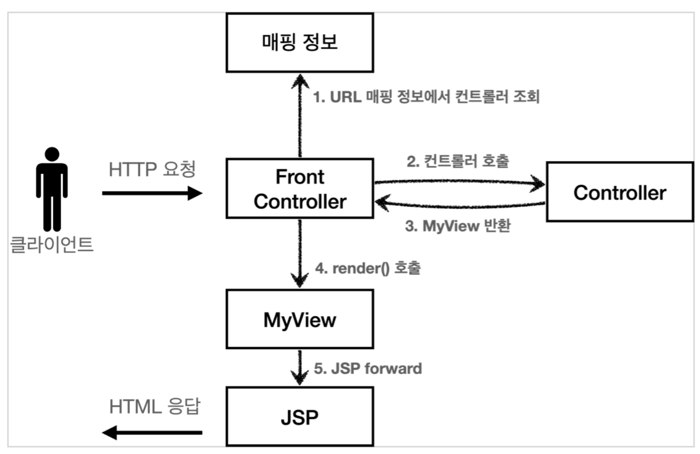

## View 분리 - v2

모든 컨트롤러에서 뷰로 이동하는 부분에 중복이 있고, 깔끔하지 않다.

```java
String viewPath = "/WEB-INF/views/new-form.jsp";
RequestDispatcher dispatcher = request.getRequestDispatcher(viewPath);
dispatcher.forward(reqeust, response);
```

이 부분을 깔끔하게 분리하기 위해 별로도 뷰를 처리하는 객체를 만들자.


#### 

ControllerV2의 반환 타입이 `MyView`이므로 프론트 컨트롤러는 컨트롤러의 호출 결과로 `MyView`를 반환 받는다. 그리고 `view.render()`를 호출하면 `forward` 로직을 수행해서 JSP가 실행된다.
