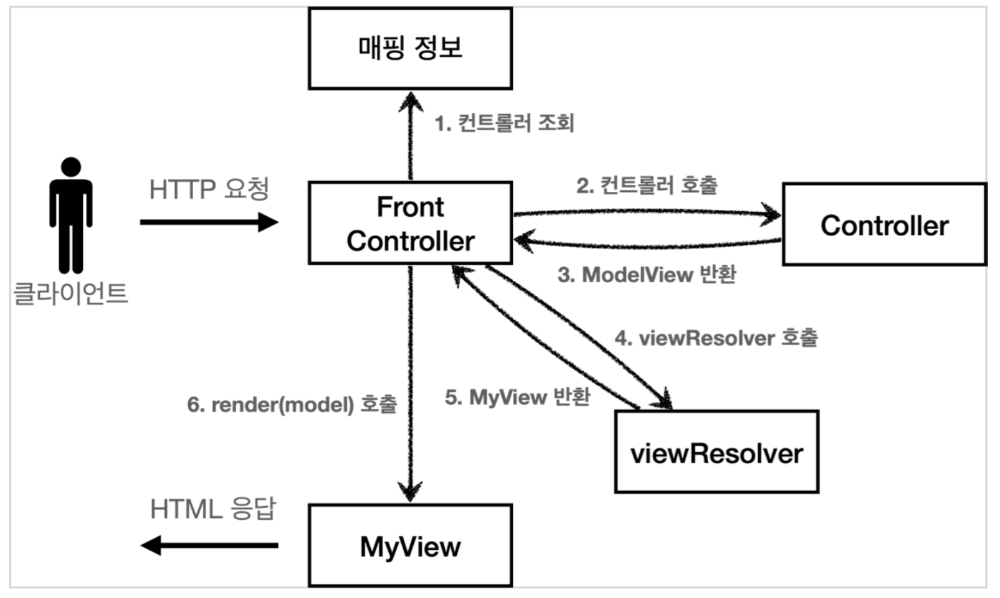

## Model 추가 - v3

### 서블릿 종속성 제거

컨트롤러 입장에서 HttpServletRequest, HttpServletResponse이 꼭 필요할까?
요청 파라미터 정보는 자바의 Map으로 대신 넘기도록 하면 지금 구조에서는 컨트롤러가 서블릿 기술을 몰라도 동작할 수 있다.
그리고 request 객체를 Model로 사용하는 대신 별도의 Model 객체를 만들어서 반환하면 된다.
우리가 구현하는 컨트롤러가 서블릿 기술을 전혀 사용하지 않도록 변경해보자.
이렇게 하면 구현 코드도 매우 단순해지고, 테스트 코드 작성이 쉽다.

### 뷰 이름 중복 제거

컨트롤러에서 지정하는 뷰 이름에 중복이 있는 것을 확인할 수 있다.
컨트롤러는 뷰의 논리 이름을 반환하고, 실제 물리 위치의 이름은 프론트 컨트롤러에서 처리하도록 단순화 하자.
이렇게 해두면 향후 뷰의 폴더 위차가 함께 이동해도 프론트 컨트롤러만 고치면 된다.

- `/WEB-INF/views/new-form.jsp` ->  **new-form**
- `/WEB-INF/views/save-result.jsp` ->  **save-result**
- /WEB-INF/views/members.jsp  -> **members**

### ModelView

지금까지 컨트롤러에서 서블릿에 종속적인 HttpServletRequest를 사용했다. 그리고 Model도 `request.setAttribute()`를 통해 데이터를 저장하고 뷰에 전달했다.
서블릿의 종속성을 제거하기 위해 Model을 직접 만들고, 추가로 View 이름까지 전달하는 객체를 만들어보자.
(이번 버전에서는 컨트롤러에서 HttpServletRequest를 사용할 수 없다. 따라서 직접 `reqeust.setAttribute()`)를 호출할 수도 없다. 따라서 Model이 별도로 필요하다.

참고로 `ModelView` 객체는 다른 버전에서도 사용하므로 패키지를 `frontcontroller`에 둔다.

