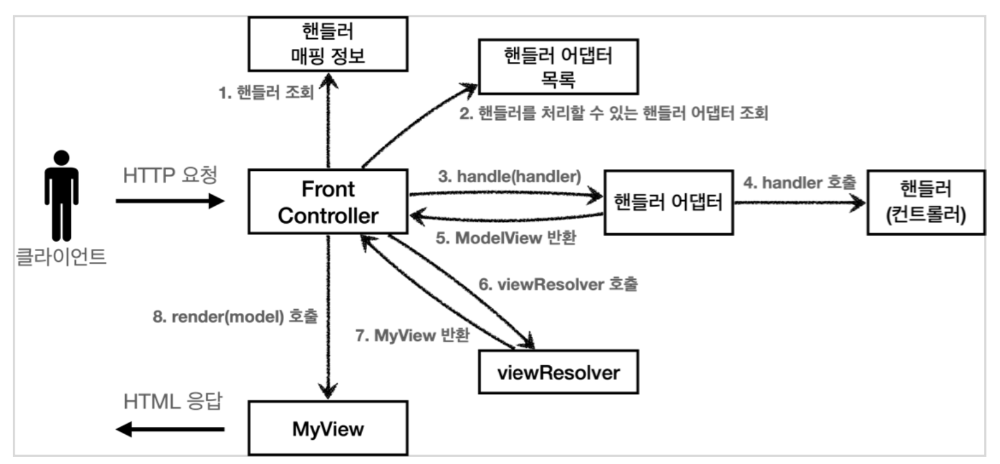

## 유연한 컨트롤러1 - v5

만약 어떤 개발자는 `ControllerV3` 방식으로 개발하고 싶고, 어떤 개발자는 `ControllerV4` 방식으로 개발하고 싶다면 어떻게 해야할까?

### 어댑터 패턴

지금까지 우리가 개발한 프론트 컨트롤러는 한가지 방식의 컨트롤러 인터페이스만 사용할 수 있다.
`ControllerV3`, `ControllerV4` 는 완전히 다른 인터페이스이다. 따라서 호환이 불가능하다. 마치 v3는 110v이고, v4는 220v 전기 콘센트 같은 것이다. 이럴 떄 사용하는 것이 바로 어댑터이다.
**어댑터 패턴**을 사용해서 프론트 컨트롤러가 다양한 방식의 컨트롤러를 처리할 수 있도록 변경해보자.

- **핸들러 어댑터** : 중간에 어댑터 역할을 하는 어댑터가 추가되었는데 이름이 핸들러 어댑터이다. 여기서 어댑터 역할을 해주는 덕분에 다양한 종류의 컨트롤러를 호출할 수 있다.
- **핸들러** : 컨트롤러의 이름을 더 넓은 범위인 핸들러로 변경했다. 그 이유는 이제 어댑터가 있기 떄문에 꼭 컨트롤러의 개념 뿐만 아니라 어떠한 것이든 해당하는 종류의 어댑터만 있으면 다 처리할 수 있기 때문이다.

### 컨트롤러(Controller) -> 핸들러(Handler)

이전에는 컨트롤러를 직접 매핑해서 사용했다. 그런데 이제는 어댑터를 사용하기 때문에, 컨트롤러 뿐만 아니라 어댑터가 지원하기만 하면, 어떤 것이라도 URL매핑해서 사용할 수 있다. 그래서 이름을 컨트롤러에서 더 넓은 범위의 핸들러로 변경했다.

