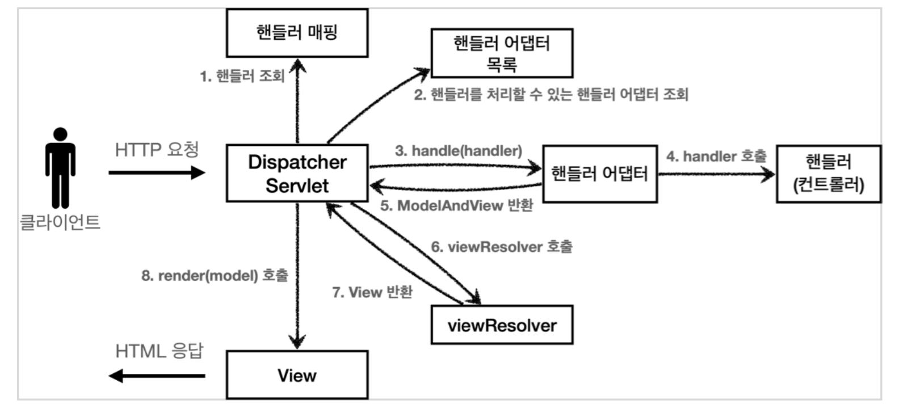
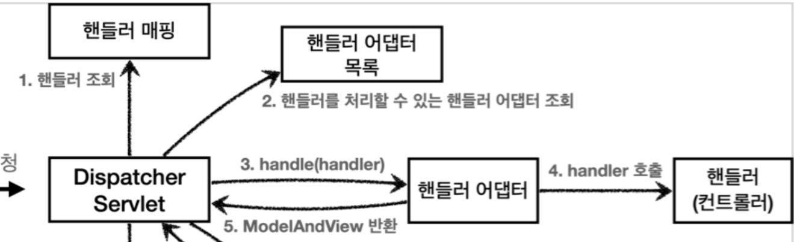
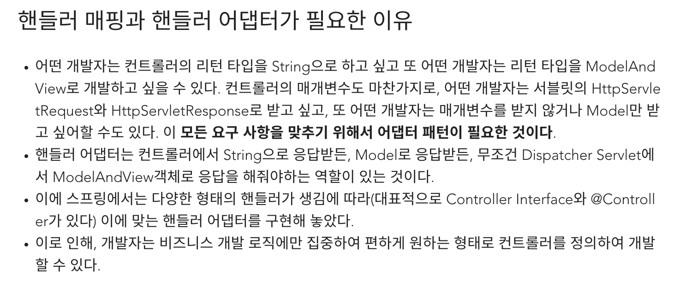

## 핸들러 매핑과 핸들러 어댑터

핸들러 매핑과 핸들러 어댑터가 어떤 것들이 어떻게 사용되는지 알아보자.
지금은 전혀 사용하지 않지만, 과거에 주로 사용했던 스프링이 제공하는 간단한 컨트롤러로 핸들러 매핑과 어댑터를 이해해보자.

### Controller 인터페이스

#### 과거 버전 스프링 컨트롤러

`org.springframework.web.servlet.mvc.Controller`

```java
public interface Controller {
	ModelAndView handleRequest(HttpServletRequest request, HttpServletResponse response) throws Exception;
}
```

스프링도 처음에는 이런 딱딱한 형식의 컨트롤러를 제공했다.

> **참고**
>
> `Controller` 인터페이스는 `@Controller` 애노테이션과 전혀 다르다.



이 컨트롤러가 호출되려면 다음 2가지가 필요하다

- **HandlerMapping(핸들러 매핑)**
  - 핸들러 매핑에서 이 컨트롤러를 찾을 수 있어야 한다.
  - 예) **스프링 빈의 이름으로 핸들러를 찾을 수 있는 핸들러 매핑**이 필요하다.
- **HandlerAdapter(핸들러 어댑터)**
  - 핸들러 매핑을 통해서 찾은 핸들러를 실행할 수 있는 핸들러 어댑터가 필요하다.
  - 예) `Controller` 인터페이스를 실행할 수 있는 핸들러 어댑터를 찾고 실행해야 한다.

#### 스프링 부트가 자동 등록하는 핸들러 매핑과 핸들러 어댑터

(실제로는 더 많지만, 중요한 부분 위주로 설명하기 위해 일부 생략)

##### <u>HandlerMapping</u>

**0 = RequestMappingHandlerMapping** : 애노테이션 기반의 컨트롤러인 @RequestMapping에서 사용

**1 = BeanNameUrlHandlerMapping** : 스프링 빈의 이름으로 핸들러를 찾는다.

<hr>

##### <u>HandlerAdapter</u>

**0 = RequestMappingHandlerAdapter** : 애노테이션 기반의 컨트롤러인 @RequestMapping에서 사용

**1 = HttpReqeustHandlerAdapter** : HttpRequestHandler 처리

**2 = SimpleControllerHandlerAdapter** : Controller 인터페이스(애느테이션X, 과거에 사용) 처리

핸들러 매핑도, 핸들러 어댑터도 모두 순서대로 찾고 만약 없으면 다음 순서로 넘긴다.


##### 1. 핸들러 매핑으로 핸들러 조회

1. `HandlerMapping`을 순서대로 실행해서, 핸들러를 찾는다.
2. 이 경우 빈 이름으로 핸들러를 찾아야 하기 때문에 이름 그대로 빈 이름으로 핸들러를 찾아주는 `BeanNameUrlHandlerMapping`가 실행에 성공하고 핸들러인 `OldHandler`를 반환한다.

##### 2. 핸들러 어댑터 조회

1. `HandlerAdapter`의 `supports()`를 순서대로 호출한다.
2. `SimpleControllerHandlerAdapter`가 `Controller` 인터페이스를 지원하므로 대상이 된다.

##### 3. 핸들러 어댑터 실행

1. 디스패처 서블릿이 조회한 `SimpleControllerHandlerAdapter`를 실행하면서 핸드럴 정보도 함께 넘겨준다.
2. `SimpleControllerHandlerAdapter`는 핸들러인 `OldController`를 내부에서 실행하고, 그 결과를 반환한다.

##### 정리 - OldController 핸들러 매핑, 어댑터

`OldController`를 실행하면서 사용된 객체는 다음과 같다
`HandlerMapping = BeanNameUrlHandlerMapping`
`HandlerAdapter = SimpleControllerHandlerAdapter`


<hr>

### HttpRequestHandler

핸들러 매핑과, 어댑터를 잘 이해하기 위해 Controller 인터페이스가 아닌 다른 핸들러를 알아보자.
`HttpRequestHandler`핸들러(컨트롤러)는 **서블릿과 가장 유사한 형태**의 핸들러이다.

```java
void handleRequest(HttpServletRequest request, HttpServletResponse response)
  throws ServletException, IOException;
```


##### 1. 핸들러 매핑으로 핸들러 조회

1. `HandlerMapping`을 순서대로 실행해서, 핸들러를 찾는다.
2. 이 경우 빈 이름으로 핸들러를 찾아야 하기 때문에 이름 그대로 빈 이름으로 핸들러를 찾아주는 `BeanNameUrlHandlerMapping`가 실행에 성공하고 핸들러인 `MyHttpReqeustHandler`를 반환한다.

##### 2. 핸들러 어댑터 조회

1. `HandlerAdapter`의 `supports()`를 순서대로 호출한다.
2. `HttpRequestHandlerAdapter`가 `HttpRequestHandler` 인터페이스를 지원하므로 대상이 된다.

##### 3. 핸들러 어댑터 실행

1. 디스패처 서블릿이 조회한 `HttpRequestHandlerAdapter`를 실행하면서 핸들러 정보도 함께 넘겨준다
2. `HttpRequestHandlerAdapter`는 핸들러인 `MyHttpRequestHandler`를 내부에서 실행하고, 그 결과를 반환한다.

##### 정리 - MyHttpRequestHandler 핸들러 매핑, 어댑터

`MyHttpRequestHandler`를 실행하면서 사용된 객체는 다음과 같다.
`HandlerMapping = BeanNameUrlHandlerMapping`
`HandlerAdapter = HttpRequestHandlerAdapter`



##### @RequestMapping

조금 뒤에서 설명하겠지만, 가장 우선순위가 높은 핸들러 매핑과 핸들러 어댑터는 `ReqeustMappingHandlerMapping`, `RequestMappingHandlerAdapter`이다.
`@ReqeustMapping`의 앞글자를 따서 만든 이름인데 이것이 바로 지금 스프링에서 주로 사용하는 애노테이션 기반의 컨트롤러를 지원하는 매핑과 어댑터이다. 실무에서는 99.9999% 이 방식의 컨트롤러를 사용한다.


